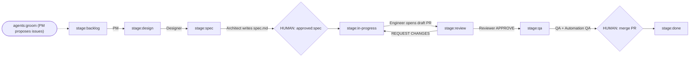

# Agentic Workspace — Full Workflow

End-to-end guide for running one issue through the pipeline, from creation to `done`, including worktree cleanup.

See [README.md](./README.md) for architecture and file layout.

## Prerequisites (once)

```bash
# Active GitHub account must own the repo (label + PR permissions)
gh auth status            # expect: Logged in to github.com account <owner>

# Cursor SDK key in .env.local
#   CURSOR_API_KEY=cursor_...
#   GITHUB_REPO=dzakdzaks/unspoken

# Pipeline labels (idempotent; safe to re-run)
bun run agents:seed-labels
```

Agent scripts run on Node via `tsx` (the Cursor SDK requires Node HTTP/2; Bun is not compatible for SDK calls). The `bun run agents:*` scripts already invoke `tsx`.

## Pipeline overview



Each `agents:tick` advances **one stage per issue**. Run it repeatedly, or use `agents:watch` to poll every 60s.

State is tracked by GitHub labels (`stage:*`, `approved:spec`, `needs:human`) with a YAML frontmatter fallback in the issue body when label permissions are unavailable.

## Step 1 — Create an issue

You can create the starting issue two ways: let the PM agent propose it from the
PRD (Step 1a), or write it by hand (Step 1b). Either way it must land at
`stage:backlog` with the `agent:pipeline` label.

### Step 1a — PM auto-creates issues (`agents:groom`)

The Product Manager scans `PRD.md` (Risks / Open Questions / Future
Considerations), skips anything already covered by an open issue, and proposes up
to 3 new backlog issues. Proposals are **review-first** — nothing is created
without `--confirm`.

```bash
# Propose from the PRD (prints proposals, creates nothing)
bun run agents:groom

# Bias toward a theme
bun run agents:groom -- --goal "improve first-time user onboarding"

# Create the proposed issues (stage:backlog + agent:pipeline)
bun run agents:groom -- --confirm
```

Created issues are deduped by title and start at `stage:backlog`, ready for
Step 2. Note the issue number (e.g. `#5`) — used below as `<n>`.

### Step 1b — Create an issue manually

```bash
gh issue create --repo dzakdzaks/unspoken \
  --title "Add gender-neutral copy option" \
  --body "Users may not want the 'What She Really Meant' framing (PRD R4)." \
  --label "agent:pipeline" \
  --label "stage:backlog"
```

- `agent:pipeline` — required; marks the issue for the orchestrator.
- `stage:backlog` — required; the starting stage.

Note the issue number (e.g. `#5`) — used below as `<n>`.

## Step 2 — PM grooming (backlog → design)

```bash
bun run agents:tick
```

Produces `.agent-workspace/<n>/requirements.md` (problem, user story, acceptance criteria, out-of-scope, success metrics) and advances to `stage:design`.

## Step 3 — Design (design → spec)

```bash
bun run agents:tick
```

Produces `.agent-workspace/<n>/design.md` and advances to `stage:spec`.

## Step 4 — Architect spec (spec → HUMAN GATE)

```bash
bun run agents:tick
```

Produces `.agent-workspace/<n>/spec.md` and **stops** at the spec approval gate. A tick at this point reports:

```
#<n> blocked: Spec written. Waiting for human to add approved:spec label.
```

### Human gate 1 — approve the spec

Review the spec:

```bash
cat .agent-workspace/<n>/spec.md
```

Approve (either works; label is primary):

```bash
gh issue edit <n> --repo dzakdzaks/unspoken --add-label approved:spec
```

## Step 5 — Engineer implementation (in-progress → review)

```bash
bun run agents:tick
```

On this tick the orchestrator:
1. Moves the issue to `stage:in-progress`.
2. Creates an isolated worktree at `.agent-worktrees/issue-<n>/` on branch `agent/issue-<n>`.
3. Runs the engineer agent to implement the spec.
4. Verifies `bun run lint` and `bun run build`.
5. Opens a **draft PR** linked to the issue, then advances to `stage:review`.

If a PR already exists and lint/build pass, the engineer step short-circuits (no duplicate work).

## Step 6 — Code review (review → qa or back to in-progress)

```bash
bun run agents:tick
```

The reviewer agent posts an `APPROVE` or `REQUEST CHANGES` review on the PR.

- **APPROVE** → advances to `stage:qa`.
- **REQUEST CHANGES** → returns to `stage:in-progress`; the engineer reworks on the next tick.
- After `MAX_REVIEW_RETRIES` (3) bounces, the issue is labeled `needs:human` and the pipeline stops for that issue.

## Step 7 — QA test plan (qa)

```bash
bun run agents:tick
```

Produces `.agent-workspace/<n>/test-plan.md` (manual + automated cases mapped to acceptance criteria). Stays at `stage:qa`.

## Step 8 — Automation QA (qa → HUMAN GATE)

```bash
bun run agents:tick
```

The automation-QA agent writes/extends Vitest tests in the worktree, pushes to the PR branch, and runs `bun run test`. On green tests it comments:

```
All automated tests pass. Ready for human merge.
```

The issue **holds** at `stage:qa` for the merge gate.

### Human gate 2 — merge the PR

Review and merge:

```bash
gh pr view <pr-number> --repo dzakdzaks/unspoken
gh pr merge <pr-number> --repo dzakdzaks/unspoken --merge
```

(If the PR is still a draft: `gh pr ready <pr-number> --repo dzakdzaks/unspoken` first.)

## Step 9 — Mark done

```bash
bun run agents:tick
```

If the issue is still **open**, the orchestrator detects the merged PR and moves it to `stage:done`.

If merging the PR auto-**closed** the issue (via `Closes #<n>`), the normal tick skips closed issues. Mark it done explicitly:

```bash
./node_modules/.bin/tsx -e "import { updateIssueStage } from './agents/lib/github.ts'; updateIssueStage(<n>, 'done');"
```

## Step 10 — Clean up the worktree

The engineer/QA worktree persists after the run. Once the PR is merged, remove it and its branch:

```bash
# Remove the worktree directory
git worktree remove .agent-worktrees/issue-<n>

# Delete the local branch (merged)
git branch -d agent/issue-<n>

# Delete the remote branch
git push origin --delete agent/issue-<n>
```

Verify cleanup:

```bash
git worktree list           # should not list issue-<n>
git branch --list 'agent/*' # should not list agent/issue-<n>
```

If `git worktree remove` complains about untracked files (e.g. copied `.agent-workspace/` artifacts), force it:

```bash
git worktree remove --force .agent-worktrees/issue-<n>
```

## Quick reference

| Action | Command |
|--------|---------|
| Seed labels | `bun run agents:seed-labels` |
| PM propose issues | `bun run agents:groom` |
| PM create issues | `bun run agents:groom -- --confirm` |
| One stage advance | `bun run agents:tick` |
| Continuous (60s) | `bun run agents:watch` |
| Dry run (no SDK/writes) | `bun run agents:tick -- --dry-run --issue <n>` |
| Single issue | `bun run agents:tick -- --issue <n>` |
| Approve spec | `gh issue edit <n> --repo dzakdzaks/unspoken --add-label approved:spec` |
| Merge PR | `gh pr merge <pr> --repo dzakdzaks/unspoken --merge` |
| Remove worktree | `git worktree remove .agent-worktrees/issue-<n>` |

## Gate summary

| Gate | Where | Action to pass |
|------|-------|----------------|
| 1. Spec approval | `stage:spec` | Add `approved:spec` label |
| 2. PR merge | `stage:qa` | Merge the PR on GitHub |

The loop never advances past either gate on its own.

## Artifacts per issue

`.agent-workspace/<n>/` (gitignored by default):

- `requirements.md` — PM
- `design.md` — Designer
- `spec.md` — Architect
- `test-plan.md` — QA

`.agent-worktrees/issue-<n>/` (gitignored) — ephemeral engineer/QA checkout on branch `agent/issue-<n>`.
